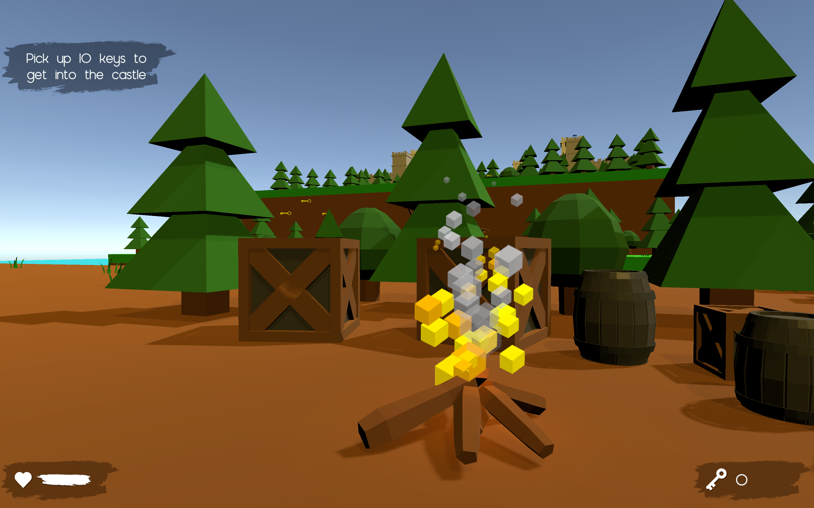
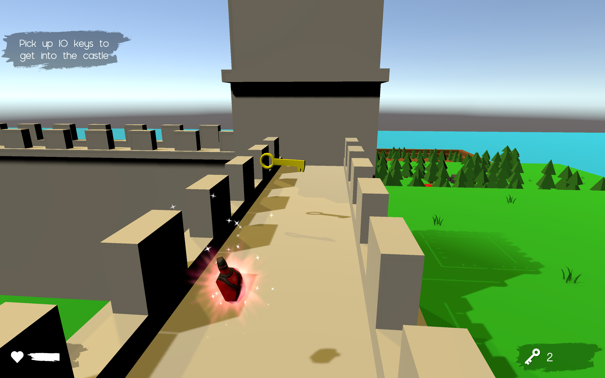
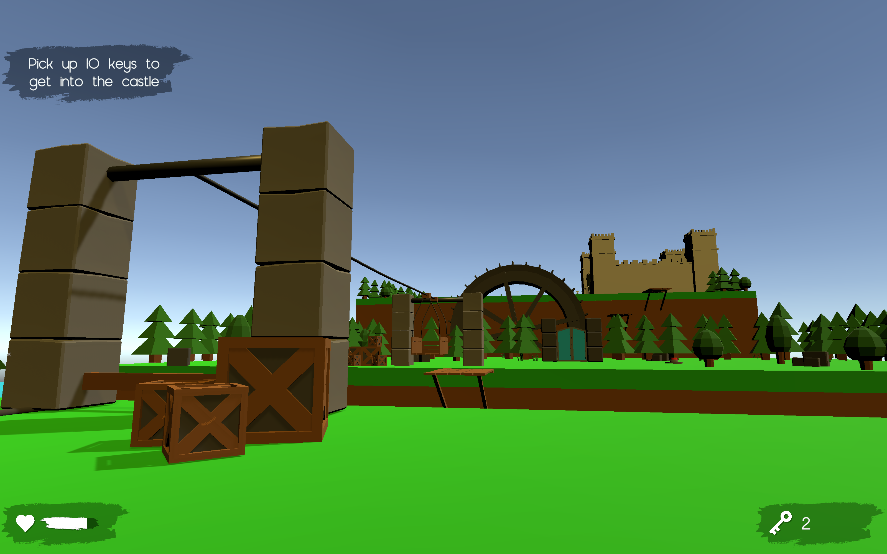

# Simple-Arcade
A simple arcade as a learn project made with Unity.

In this game you need to find the keys and avoid traps to reach the final castle and open its gates.

To play the game download and unzip **SimpleArcade.zip** and start **Simple-Arcade.exe**

The Game currently builded only for Windows!

